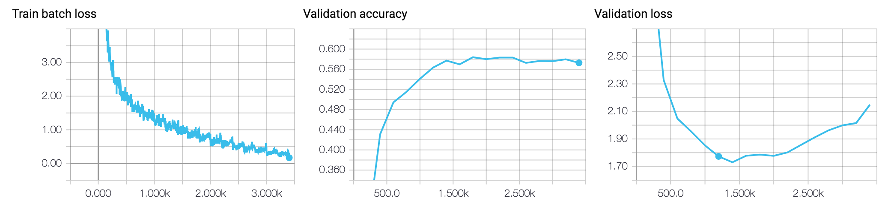

# Tiny Imagenet
This project follows the assignment 2. of [Practical Machine Learning](http://www.suyongeum.com/ML/index.php).

## Dependencies
- tensorflow >= 1.4
- numpy

## Setup
1. Download training dataset at [tiny-imagenet](https://tiny-imagenet.herokuapp.com) and put it on the `data` directory.
2. Download a pretrained VGG16 Model from [http://download.tensorflow.org/models/vgg_16_2016_08_28.tar.gz](http://download.tensorflow.org/models/vgg_16_2016_08_28.tar.gz), extract and put `vgg16.ckpt` on the `pretrained` directory.
3. (Optional) For evaluating the assignment test files, download it at [http://www.suyongeum.com/ML/assignments.php](http://www.suyongeum.com/ML/assignments.php)
4. Please run the `train.py` or `predict.py`

## Model
I used the VGG-16 Model and show the architectures below in detail.

### Architecture
1. input layer: output=64x64x3, ksize=[2, 2]
2. conv1 layer: output=64x64x64, ksize=[3, 3], stride=1
3. pool1 layer: output=32x32x64, func=max, ksize=[2, 2]
4. conv2 layer: output=32x32x128, ksize=[3, 3], stride=1
5. pool2 layer: output=16x16x128, func=max, ksize=[2, 2]
6. conv3 layer: output=16x16x256, ksize=[3, 3], stride=1
7. pool3 layer: output=8x8x256, func=max, ksize=[2, 2]
8. conv4 layer: output=8x8x512, ksize=[3, 3], stride=1
9. pool4 layer: output=4x4x512, func=max, ksize=[2, 2]
10. conv5 layer: output=4x4x512, ksize=[3, 3], stride=1
11. pool5 layer: output=2x2x512, func=max, ksize=[2, 2]
12. fc1 layer: output=512
13. fc2 layer: output200

### Settings
- optimization: adam(lr=0.01)
- batch size: 500
- epoch: 10000
- regularization: weight decay(add L2 norm into loss)
- all activation function: ReLU
- data augumentation:
	- brightness
	- contrast
	- saturation
	- crop
	- flip the image left or right 
	- normalization
- To use a prepared pretrained model before training

## Results

